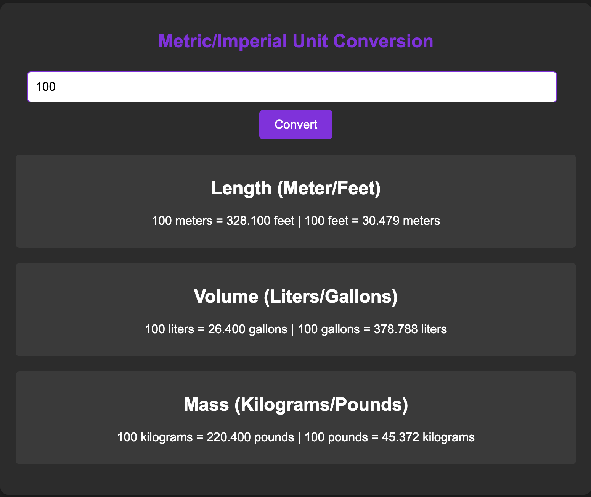

# Unit Converter

## Overview

The Unit Converter is a simple web application designed to convert values between metric and imperial units. The app supports three types of conversions:

- **Length:** Meters to Feet and Feet to Meters
- **Volume:** Liters to Gallons and Gallons to Liters
- **Mass:** Kilograms to Pounds and Pounds to Kilograms

## Features

- Converts units dynamically when the user inputs a value and clicks the "Convert" button.
- Displays conversions for length, volume, and mass with results rounded to three decimal places.
- Fully responsive design, optimized for mobile and desktop screens.

## Technologies Used

- **HTML**: For the structure of the app.
- **CSS**: For styling and responsiveness.
- **JavaScript**: For the logic and functionality of unit conversions.

## How to Use

1. Open the application in a web browser.
2. Enter a numeric value in the input field.
3. Click the "Convert" button.
4. The app will display the conversions for:
   - Length (meters/feet)
   - Volume (liters/gallons)
   - Mass (kilograms/pounds)

## File Structure

### **index.html**

The main HTML file provides the structure of the app, including:

- Input field for entering the value.
- Button to trigger conversions.
- Sections to display results for length, volume, and mass.

### **styles.css**

This file contains styles to:

- Center the app and make it visually appealing.
- Add responsiveness for both mobile and desktop views.
- Style the input field, button, and result sections consistently.

### **script.js**

The JavaScript file includes:

- Event listener for the "Convert" button.
- Conversion logic using appropriate conversion factors:
  - **1 meter = 3.281 feet**
  - **1 liter = 0.264 gallon**
  - **1 kilogram = 2.204 pounds**
- Functions to validate input, calculate conversions, and display results.

## Installation

1. Clone this repository:
   ```bash
   git clone <repository_url>
   ```
2. Navigate to the project folder:
   ```bash
   cd unit-converter
   ```
3. Open `index.html` in your web browser to use the application.

## Screenshots

### Input and Button Section


### Conversion Results



## Future Enhancements

- Add more conversion types (e.g., temperature, speed).
- Allow users to select specific conversion types instead of displaying all results.
- Save user preferences and history using `localStorage`.

## License

This project is open-source and available under the MIT License.

## Acknowledgements

Inspired by common unit conversion needs, built with simplicity and usability in mind.
